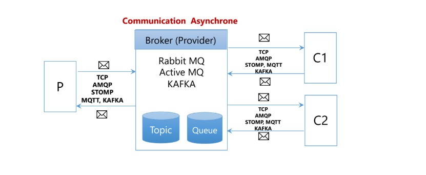
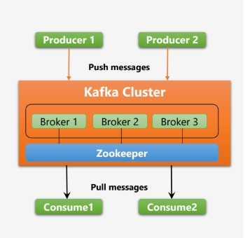
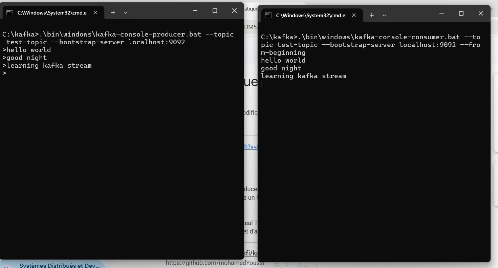
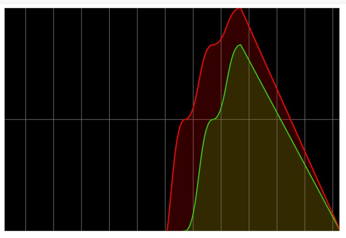

<h1>Event-Driven Architecture: JMS & Kafka</h1>

<h2>1. Messaging Models</h2>

<h3>Topic (One-to-Many)</h3>

In the <strong>Topic</strong> model, when consumers are connected to a broker,
each message sent to the topic is delivered to <strong>all connected consumers</strong>.

<h3>Queue (One-to-One)</h3>

In the <strong>Queue</strong> model, each message is delivered to <strong>only one consumer</strong>,
in the order the consumers are connected.

<strong>Broker role:</strong> receive, store, and deliver messages to consumers.

<h2>2. Message Delivery Techniques</h2>

<h3>Push Model (JMS)</h3>

In the <strong>push</strong> model, messages are sent automatically to the consumer
as soon as it connects, then removed from the broker.

<strong>Disadvantage:</strong> the broker pushes all messages even if the consumer
does not have enough resources to process them.

<h3>Pull Model (Kafka)</h3>

Kafka uses the <strong>pull</strong> model: consumers request messages when they are ready.
This gives better control over processing speed.

<h2>3. Apache Kafka Overview</h2>

Apache Kafka is used for communication between <strong>distributed applications</strong>.

<ul>
    <li>Acts as an <strong>Event Store</strong> (stores events produced by applications)</li>
    <li>Plays the role of a <strong>broker</strong> like JMS or RabbitMQ</li>
    <li>Stores data in a <strong>durable</strong> and <strong>fault-tolerant</strong> way</li>
    <li>Supports <strong>real-time stream processing</strong></li>
</ul>

<h3>Processing Types</h3>

<ul>
    <li><strong>Stream Processing:</strong> process data in real time</li>
    <li><strong>Batch Processing:</strong> process historical data (analytics, statistics)</li>
</ul>

Kafka is <strong>not a Big Data storage system</strong>.

<h3>Big Data Tools</h3>
<ul>
    <li><strong>MapReduce:</strong> old model</li>
    <li><strong>Spark + HDFS:</strong> modern Big Data processing</li>
</ul>

<h2>4. Kafka Consumers and Consumer Groups</h2>

Kafka consumers work in <strong>consumer groups</strong>.

<ul>
    <li>Each partition is consumed by only one consumer in a group</li>
    <li>Multiple consumers in one group = <strong>Queue behavior</strong></li>
    <li>Multiple groups on the same topic = <strong>Topic behavior</strong></li>
</ul>

<h3>Simple Example</h3>

Imagine a book with 200,000 pages:

<ol>
    <li>
        <strong>Partitioning:</strong> split the book into multiple partitions to distribute the data across the cluster.
    </li>
    <li>
        <strong>Replication:</strong> duplicate partitions on different nodes to ensure fault tolerance.
    </li>
    <li>
        <strong>Scalability:</strong> when a broker is added or removed, partitions can be reassigned across the cluster to balance the data and processing load.
    </li>
</ol>

<h2>5. ZooKeeper</h2>

ZooKeeper acts as a <strong>coordinator</strong> between Kafka cluster instances.

<ul>
    <li>Manages partition distribution</li>
    <li>Ensures replication</li>
    <li>Handles scalability and leader election</li>
</ul>

<h2>6. Kafka APIs</h2>

<ul>
    <li><strong>Producer API:</strong> send messages to Kafka</li>
    <li><strong>Consumer API:</strong> read messages from Kafka</li>
    <li><strong>Streams API:</strong> real-time stream processing</li>
    <li><strong>Connect API:</strong> integrate Kafka with external systems (MongoDB, databases, etc.)</li>
</ul>

<h2>7. Kafka Commands Used in the Project</h2>

<h3>Cluster UUID</h3>

<strong>JRBzyPS2T6yG0Q_44gRMRQ</strong> — Unique identifier of the Kafka KRaft cluster.

<h3>Format Kafka Storage</h3>
<pre>
kafka-storage.bat format -t JRBzyPS2T6yG0Q_44gRMRQ -c server.properties
</pre>

Initializes Kafka log storage (required on first startup).

<h3>Start ZooKeeper</h3>
<pre>
zookeeper-server-start.bat zookeeper.properties
</pre>

Starts ZooKeeper coordination service (keep the window open).

<h3>Start Kafka Server</h3>
<pre>
kafka-server-start.bat server.properties
</pre>

Starts the Kafka broker.

<h3>Create Topic</h3>
<pre>
kafka-topics.bat --create --topic test-topic --bootstrap-server localhost:9092 --partitions 1 --replication-factor 1
</pre>

Creates a topic with one partition and one replica.

<h3>Start Consumer</h3>
<pre>
kafka-console-consumer.bat --topic test-topic --bootstrap-server localhost:9092 --from-beginning
</pre>

Reads all messages from the beginning of the topic.

<h3>Start Producer</h3>
<pre>
kafka-console-producer.bat --topic test-topic --bootstrap-server localhost:9092
</pre>

Sends messages to the topic.

<h3>Consumer with Key and Deserializers</h3>
<pre>
kafka-console-consumer.bat --topic T3 --bootstrap-server localhost:9092
--from-beginning --property print.key=true
--key-deserializer StringDeserializer
--value-deserializer LongDeserializer
</pre>

Consumes messages while displaying keys and deserializing values.

<h2>8. Project Demos</h2>

<h3>Demo 1: Producer & Consumer</h3>

Producer and consumer connected to <strong>test-topic</strong>.

<h3>Demo 2: Real-Time Web Application</h3>

Web application displaying <strong>real-time stream analytics</strong>.

